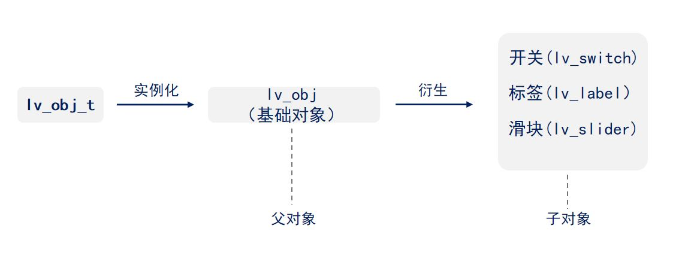
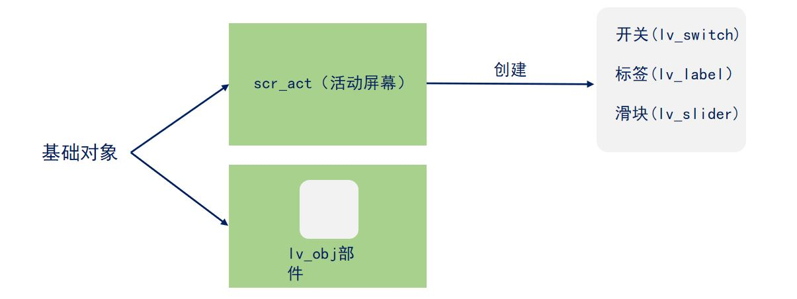
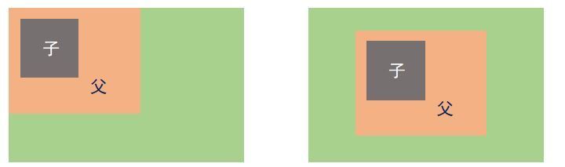
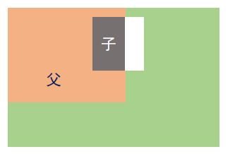
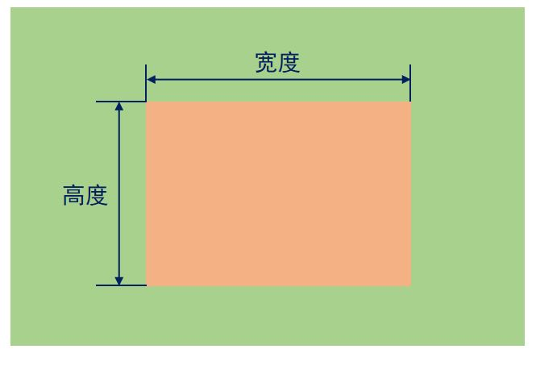
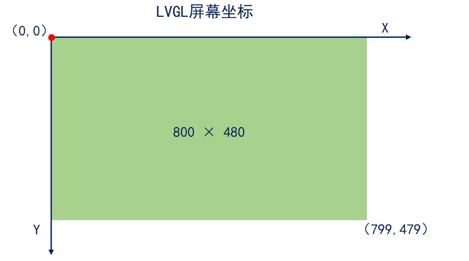
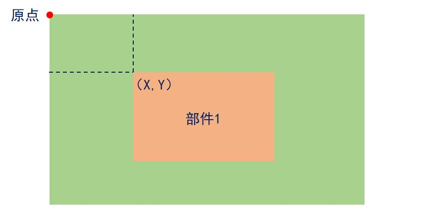
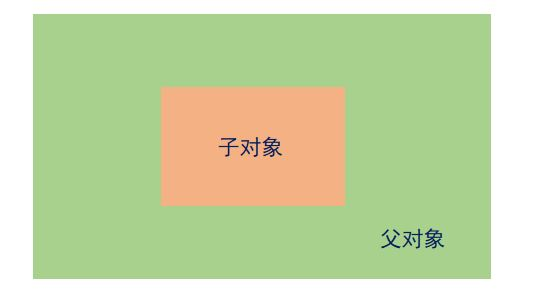
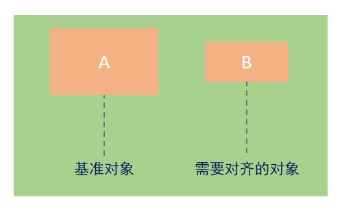
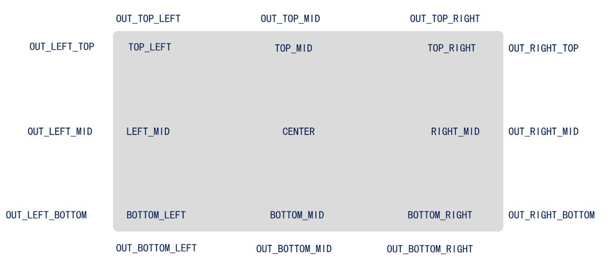

# STM32 LVGL 2_LVGL基础对象

## 1. 基础对象`lv_obj`

### 基础对象的概念

LVGL 通过面向对象的思想进行编程。由于C语言中不存在类的概念，LVGL 通过结构体的方式实现类。



> 使用`lv_obj_t`结构体实例化当前界面的基础对象`lv_obj`，基础对象是最基本的父对象。由基础对象衍生出对应的子对象。

基础对象`lv_obj`可以作为父对象，来创建其他对象，同时它也可作为部件使用。



### 父对象和子对象

- 父对象和子对象的关系：

> 1. 子对象会随着父对象移动。
>
> 
>
> 2. 子对象的位置超出父对象的范围，则超出的部分不显示。（不建议超出父对象的范围）
>
> 

## 2. 部件的基本属性

### 大小`size`



API 函数如下：

```c
/**
  * @brief	大小设置函数
  * @param	obj	对象指针
  * @param	w	宽度
  * @param  h	高度	
  */
void lv_obj_set_size(lv_obj_t * obj, lv_coord_t w, lv_coord_t h);

/**
  * @brief	宽度设置函数
  * @param	obj	对象指针
  * @param	w	宽度
  */
void lv_obj_set_width(lv_obj_t * obj, lv_coord_t w);

/**
  * @brief	高度设置函数
  * @param	obj	对象指针
  * @param  h	高度	
  */
void lv_obj_set_height(lv_obj_t * obj, lv_coord_t h);
```

### 位置`position`





设置部件位置时，**坐标原点在父对象的左上角**。

API函数：

```c
/**
  * @brief	位置设置函数
  * @param	obj	对象指针
  * @param	x	x坐标
  * @param  y	y坐标	
  */
void lv_obj_set_pos(lv_obj_t * obj, lv_coord_t x, lv_coord_t y);

/**
  * @brief	x坐标设置函数
  * @param	obj	对象指针
  * @param	x	x坐标
  */
void lv_obj_set_x(lv_obj_t * obj, lv_coord_t x);


/**
  * @brief	y坐标设置函数
  * @param	obj	对象指针
  * @param	y	y坐标
  */
void lv_obj_set_y(lv_obj_t * obj, lv_coord_t y);
```

### 对齐`alignment`

- 参照父对象对齐



- 参照其他对象对齐



```c
/**
  * @brief	参照父对象对齐
  * @param	obj		父对象
  * @param	align	对齐方式
  */
void lv_obj_set_align(lv_obj_t * obj, lv_align_t align);

/**
  * @brief	参照父对象对齐后进行偏移
  * @param	obj		父对象
  * @param	align	对齐方式
  * @param	x_ofs	x轴偏移量
  * @param  y_ofs	y轴偏移量
  */
void lv_obj_align(lv_obj_t * obj, lv_align_t align, lv_coord_t x_ofs, lv_coord_t y_ofs);

/**
  * @brief 	参照其他对象对齐（无父子关系），再进行偏移
  * @param	obj		父对象
  * @param	align	对齐方式
  * @param	x_ofs	x轴偏移量
  * @param  y_ofs	y轴偏移量
  */
void lv_obj_align_to(lv_obj_t * obj, const lv_obj_t * base, lv_align_t align, lv_coord_t x_ofs, lv_coord_t y_ofs);
```

- 对齐方式宏定义：



### 样式`styles`

样式用于设置部件的外观，以优化显示界面和实现用户交互。

```c
// 添加普通样式
static lv_style_t style; 							/* 定义样式变量 */
lv_style_init(&style); 								/* 初始化样式 */
lv_style_set_bg_color(&style, lv_color_hex(0xf4b183)); /* 设置背景颜色 */

lv_obj_t * obj = lv_obj_create(lv_scr_act()); 			/* 创建一个部件 */
lv_obj_add_style(obj, & style, LV_STATE_DEFAULT); 		/* 设置部件的样式 */


// 添加本地样式
lv_obj_t * obj = lv_obj_create(lv_scr_act()); 			/* 创建一个部件 */
lv_obj_set_style_bg_color(obj, lv_color_hex(0xf4b183),LV_STATE_DEFAULT);	/* 设置部件的样式 */
```

可以设置以下的样式：大小`Size`，位置`Position`，背景`Background`，轮廓`Outline`，边框`Border`，阴影`Shadow`，其它`Others`。

- 样式可以在以下枚举类型的情况下生效：

```c
enum {
    LV_STATE_DEFAULT     =  0x0000, /* 默认状态 */
    LV_STATE_CHECKED     =  0x0001, /* 切换或选中状态 */
    LV_STATE_FOCUSED     =  0x0002, /* 通过键盘、编码器聚焦或通过触摸板、鼠标单击 */
    LV_STATE_FOCUS_KEY   =  0x0004, /* 通过键盘、编码器聚焦 */
    LV_STATE_EDITED      =  0x0008, /* 由编码器编辑 */
    LV_STATE_HOVERED     =  0x0010, /* 鼠标悬停（现在不支持）*/
    LV_STATE_PRESSED     =  0x0020, /* 已按下 */
    LV_STATE_SCROLLED    =  0x0040, /* 滚动状态 */
    LV_STATE_DISABLED    =  0x0080, /* 禁用状态 */

    LV_STATE_USER_1      =  0x1000,
    LV_STATE_USER_2      =  0x2000,
    LV_STATE_USER_3      =  0x4000,
    LV_STATE_USER_4      =  0x8000,

    LV_STATE_ANY = 0xFFFF,    /**< Special value can be used in some functions to target all states*/
};
```

- 通过以下结构体可以指定部件特定部分的样式：

```c
enum {
    LV_PART_MAIN		= 0x000000, 	 	/* 主体，像矩形一样的背景 */
    LV_PART_SCROLLBAR	= 0x010000, 	 	/* 滚动条 */
    LV_PART_INDICATOR	= 0x020000, 	 	/* 指示器，指示当前值 */
    LV_PART_KNOB		= 0x030000,	 		/* 手柄或旋钮，用于调整参数值 */
    LV_PART_SELECTED	= 0x040000, 	 	/* 选项框，指示当前选择的选项 */
    LV_PART_ITEMS		= 0x050000, 	 	/* 相似的元素，例如单元格 */
    LV_PART_TICKS		= 0x060000, 	 	/* 刻度 */
    LV_PART_CURSOR		= 0x070000, 	 	/* 光标 */
};
```

### 事件`event`

LVGL中，当发生用户感兴趣的事情时，可以触发回调事件，以执行相关的操作。

```c
/**
  * @brief 	添加事件
  * @param	obj			父对象
  * @param	event_cb	事件回调函数
  * @param	filter		事件类型
  * @param  user_data	 进入回调函数的用户数据，通常为NULL
  */
struct _lv_event_dsc_t * lv_obj_add_event_cb(lv_obj_t * obj, lv_event_cb_t event_cb, lv_event_code_t filter,void * user_data);

/**
  * @brief  删除事件
  * @param	obj			父对象
  * @param	event_cb	事件回调函数
  */
bool lv_obj_remove_event_cb(lv_obj_t * obj, lv_event_cb_t event_cb);
```

- 不同的事件类型共用回调函数，应判断事件类型后进行操作：

```c
static void event_cb( lv_event_t *e )
{
	lv_event_code_t code = lv_event_get_code(e);	/* 第一步：获取事件类型 */
	if ( code == LV_EVENT_CLICKED )				   /* 第二步：判断事件类型 */
	{
		;	 		 							/* 第三步：执行相应操作 */
	}
	else if ( code == LV_EVENT_LONG_PRESSED)
	{
		;	
	}
}
```

- 不同的部件共用一个回调函数，应判断事件来源后进行操作：

```c
static void event_cb( lv_event_t *e )
{
	lv_obj_t   *target = lv_event_get_target(e); /* 第一步：获取触发事件的部件 */
	if ( target == parent_obj )				 	/* 第二步：判断触发事件的部件 */
	{
        	;	 		 					   /* 第三步：执行相应操作 */
	}
	else if ( target == child_obj )
	{
        	;	
	}
}
```

