# STM32 LVGL 3_LVGL部件

## 1. 标签部件(`lv_label`)

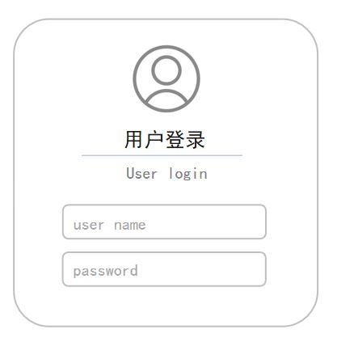

标签部件主要用于文本显示，例如标题，提示信息等。

标签部件由主体`LV_PART_MAIN`，滚动条`LV_PART_SCROLLBAR`，选中文本`LV_PART_SELECTED`组成。

### 标签部件的创建

```c
/**
  *	@brief	标签创建函数
  */
lv_obj_t * lv_label_create(lv_obj_t * parent);
```

### 标签部件的文本设置

```c
/**
  *	@brief	标签文本设置函数
  * @note	存储文本的内存将会动态分配
  * @param	obj		标签对象
  * @param	text	文本
  */
void lv_label_set_text(lv_obj_t * obj, const char * text);

/**
  *	@brief	标签文本设置函数
  * @note	存储文本的内存将会存储在指定缓冲区中
  * @param	obj		标签对象
  * @param	text	文本
  */
void lv_label_set_text_static(lv_obj_t * obj, const char * text);

/**
  *	@brief	格式化显示标签文本函数
  */
void lv_label_set_text_fmt(lv_obj_t * obj, const char * fmt, ...);
```

### 标签部件的样式设置

```c
/**
  *	@brief	背景颜色设置函数，需要设置背景透明度
  * @param	obj			标签对象
  * @param	value		颜色值
  * @param	selector	选择器，一般为默认触发
  */
void lv_obj_set_style_bg_color(struct _lv_obj_t * obj, lv_color_t value, lv_style_selector_t selector);

/**
  *	@brief	背景透明度设置函数
  * @param	obj			标签对象
  * @param	value		透明度值
  * @param	selector	选择器，一般为默认触发
  */
void lv_obj_set_style_opa(struct _lv_obj_t * obj, lv_opa_t value, lv_style_selector_t selector);

/**
  *	@brief	字体大小设置函数
  * @param	obj			标签对象
  * @param	value		字体大小值
  * @param	selector	选择器，一般为默认触发
  */
void lv_obj_set_style_text_font(struct _lv_obj_t * obj, const lv_font_t * value, lv_style_selector_t selector);

/**
  *	@brief	文本颜色设置函数
  * @param	obj			标签对象
  * @param	value		颜色值
  * @param	selector	选择器，一般为默认触发
  */
void lv_obj_set_style_text_color(struct _lv_obj_t * obj, lv_color_t value, lv_style_selector_t selector)
```

> - 如果要对文字进行单独着色，使用以下代码：
>
> ```c
> lv_label_set_recolor( label, true ); 							   /* 开启重新着色功能 */
> lv_label_set_text( label, "hallo #ff0000 lvgl# " );					/* 单独设置颜色 */
> ```

### 标签部件的大小设置

默认情况下，如果没有限定标签部件大小，标签部件的大小自动扩展为文本大小。

> 如果文本超过了标签部件的大小，使用长文本模式：
>
> ```c
> enum {
>     LV_LABEL_LONG_WRAP,             		/* 默认模式, 如果部件大小已固定，超出的文本将被剪切 */
>     LV_LABEL_LONG_DOT,              		/* 将 label 右下角的最后 3 个字符替换为点... */
>     LV_LABEL_LONG_SCROLL,           		/* 来回滚动 */
>     LV_LABEL_LONG_SCROLL_CIRCULAR,  		/* 循环滚动 */
>     LV_LABEL_LONG_CLIP,             		/* 直接剪切掉部件外面的文本部分 */
> };
> 
> /**
>   *	@brief	长文本模式设置函数
>   * @param	obj			标签对象
>   * @param	long_mode	 模式选项
>   */
> void lv_label_set_long_mode(lv_obj_t * obj, lv_label_long_mode_t long_mode);
> ```
>

## 2. 按钮部件(`lv_btn`)

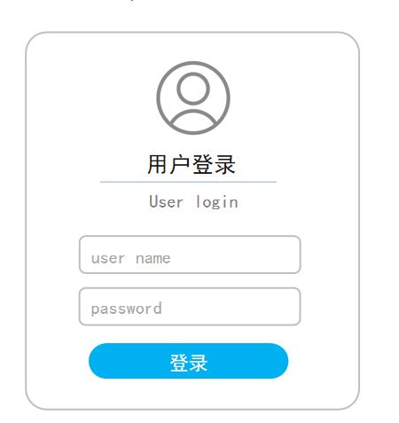

### 按钮部件的创建

```c
/**
  *	@brief	按钮创建函数
  */
lv_obj_t * lv_btn_create(lv_obj_t * parent);
```

### 按钮部件的样式设置

```c
/**
  *	@brief	背景颜色设置函数
  * @param	obj			按钮对象
  * @param	value		颜色值
  * @param	selector	选择器，一般为默认触发
  */
void lv_obj_set_style_bg_color(struct _lv_obj_t * obj, lv_color_t value, lv_style_selector_t selector);

/**
  *	@brief	大小设置函数
  * @param	obj			按钮对象
  * @param	w			宽度
  * @param	h			高度
  */
void lv_obj_set_size(lv_obj_t * obj, lv_coord_t w, lv_coord_t h);
```

### 按钮部件的事件设置

```c
/**
  *	@brief	标志设置函数
  * @param	obj			按钮对象
  * @param	f			事件标志，对于按钮为LV_OBJ_FLAG_CHECKABLE
  */
void lv_obj_add_flag(lv_obj_t * obj, lv_obj_flag_t f)
    
/**
  * @brief 	添加事件
  * @param	obj			父对象
  * @param	event_cb	事件回调函数
  * @param	filter		事件类型，通常为LV_EVENT_VALUE_CHANGED
  * @param  user_data	 进入回调函数的用户数据，通常为NULL
  */
struct _lv_event_dsc_t * lv_obj_add_event_cb(lv_obj_t * obj, lv_event_cb_t event_cb, lv_event_code_t filter,void * user_data);
```

## 3. 开关部件(`lv_switch`)

开关部件常用于控制某个功能的开启和关闭，它可以直接显示被控对象的状态。

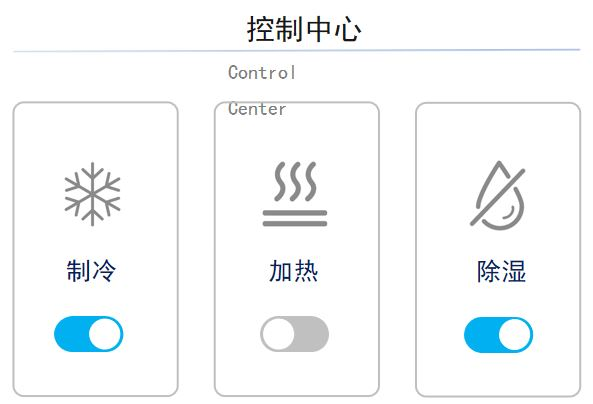

开关由主体（`LV_PART_MAIN`），手柄（`LV_PART_KNOB`），指示器（`LV_PART_INDICATOR`）构成。

### 开关部件的创建

```c
/**
  *	@brief	开关创建函数
  */
lv_obj_t * lv_switch_create(lv_obj_t * parent);
```

### 开关状态的获取和设置

```c
/**
  *	@brief	开关状态设置函数
  * @param	state	开关状态
  */
void lv_obj_add_state(lv_obj_t * obj, lv_state_t state);

/**
  *	@brief	开关状态清除函数
  * @param	state	开关状态
  */
void lv_obj_clear_state(lv_obj_t * obj, lv_state_t state);

/**
  *	@brief	开关状态获取函数
  * @param	state	开关状态
  * @retval	返回bool类型
  */
bool lv_obj_clear_state(lv_obj_t * obj, lv_state_t state);
```

## 4. 复选框部件（`lv_checkbox`）

复选框部件常用于选择某个内容的开启和关闭，可以理解为自带标签的开关。


复选框部件由主体（`LV_PART_MAIN`），勾选框（`LV_PART_INDICATOR`）构成。

### 复选框部件的创建

```c
/**
  *	@brief	复选框创建函数
  */
lv_obj_t * lv_checkbox_create(lv_obj_t * parent);
```

### 复选框部件的样式设置

```c
/**
  *	@brief	复选框文本设置函数
  * @param	obj	对象指针
  * @param	txt	文本
  */
void lv_checkbox_set_text(lv_obj_t * obj, const char * txt);

/**
  *	@brief	复选框和文本间距设置函数
  * @param	obj			对象指针
  * @param	value		距离值
  * @param	selector	选择器，一般为默认触发
  */
void lv_obj_set_style_pad_column(struct _lv_obj_t * obj, lv_coord_t value, lv_style_selector_t selector);
```

### 复选框状态的获取和设置

（略）

## 5. 进度条部件（`lv_bar`）

进度条部件常用于显示当前任务的完成进度。

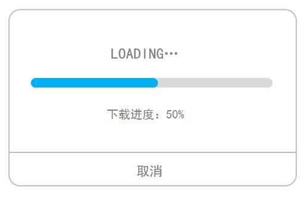

进度条部件由主体（`LV_PART_MAIN`），指示器（`LV_PART_INDICATOR`）构成。

### 进度条部件的创建

```c
/**
  *	@brief	进度条创建函数
  */
lv_obj_t * lv_bar_create(lv_obj_t * parent);
```

### 进度条部件的样式设置

```c
/**
  *	@brief	最大最小值设置函数
  * @param	obj			对象指针
  * @param	max			最大值
  * @param	min			最小值
  */
void lv_bar_set_range(lv_obj_t * obj, int32_t min, int32_t max);

/**
  *	@brief	当前值设置函数
  * @param	obj			对象指针
  * @param	value		当前值
  * @param	anim		动画使能状态，通常使用 LV_ANIM_ON
  */
void lv_bar_set_value(lv_obj_t * obj, int32_t value, lv_anim_enable_t anim);

/**
  *	@brief	动画时间设置函数
  * @param	obj			对象指针
  * @param	value		当前值
  * @param	selector	选择器，一般为默认触发
  */
void lv_obj_set_style_anim_time(struct _lv_obj_t * obj, uint32_t value, lv_style_selector_t selector);

// 模式设置
enum {
    LV_BAR_MODE_NORMAL,				/* 默认模式 */
    LV_BAR_MODE_SYMMETRICAL,		/* 从零值绘制到当前值（当前值可以小于0） */
    LV_BAR_MODE_RANGE				/* 允许设置起始值，但起始值必须小于当前值 */
};

/**
  *	@brief	模式设置函数
  * @param	obj			对象指针
  * @param	mode		模式
  */
void lv_bar_set_mode(lv_obj_t * obj, lv_bar_mode_t mode);
```

> - 当进度条高度大于宽度时，其方向变为垂直。
> - 动画时间设置需要放在当前值设置之前 ，否则看不到动画效果。
> - 动画时间指的是旧值刷新到新值的绘图时间，并不是现实中当前值变化所需的时间。

## 6. 加载器部件（`lv_spinner`）

加载器部件常用于提示当前任务正在加载。

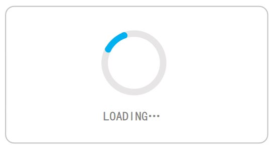

加载器部件由主体（`LV_PART_MAIN`），指示器（`LV_PART_INDICATOR`），手柄（`LV_PART_KNOB`）构成。

### 加载器部件的创建

```c
/**
  *	@brief	加载器创建函数
  */
lv_obj_t * lv_spinner_create(lv_obj_t * parent);
```

### 加载器部件的样式设置

```c
/**
  *	@brief	圆弧颜色设置函数
  * @param	obj			对象指针
  * @param	value		颜色值
  * @param	selector	选择器
  */
void lv_obj_set_style_arc_color(struct _lv_obj_t * obj, lv_color_t value, lv_style_selector_t selector);

/**
  *	@brief	圆弧宽度设置函数
  * @param	obj			对象指针
  * @param	value		宽度值
  * @param	selector	选择器
  */
void lv_obj_set_style_arc_width(struct _lv_obj_t * obj, lv_coord_t value, lv_style_selector_t selector);
```

## 7. LED 部件（`lv_led`）

LED部件常用于指示控制对象的状态。

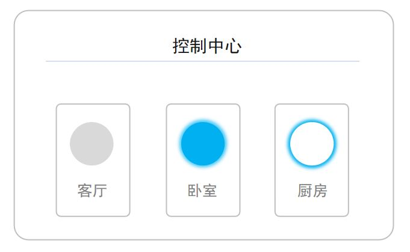

### LED 部件的创建

```c
/**
  *	@brief	LED创建函数
  */
lv_obj_t * lv_led_create(lv_obj_t * parent);
```

### LED 部件的样式设置

```c
/**
  *	@brief	LED颜色设置函数
  * @param	obj			对象指针
  * @param	color		颜色值
  */
void lv_led_set_color(lv_obj_t * obj, lv_color_t color);

/**
  *	@brief	LED亮度设置函数
  * @param	obj			对象指针
  * @param	bright		LED亮度
  */
void lv_led_set_brightness(lv_obj_t * obj, uint8_t bright);

/**
  *	@brief	LED状态设置函数
  * @param	obj			对象指针
  */
void lv_led_toggle(lv_obj_t * obj);
void lv_led_on(lv_obj_t * led);
void lv_led_off(lv_obj_t * led);
```

## 8. 列表部件（`lv_List`）

列表部件常用于多选一的场景，默认会展现多个选项。

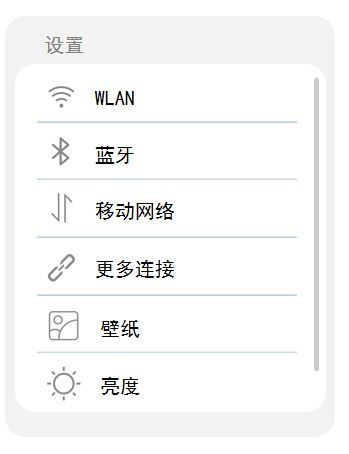

列表部件由主体（`LV_PART_MAIN`），滚动条（`LV_PART_SCROLLBAR`）构成。

### 列表部件的创建

```c
/**
  *	@brief	列表创建函数
  */
lv_obj_t * lv_list_create(lv_obj_t * parent);
```

### 列表部件的样式设置

```c
/**
  *	@brief	列表文本设置函数
  * @param	obj	对象指针
  * @param	txt	文本
  */
lv_obj_t * lv_list_add_text(lv_obj_t * list, const char * txt);

/**
  *	@brief	列表按键设置函数
  * @param	obj		对象指针
  * @param	icon	按键图标
  * @param	txt		按键文本
  */
lv_obj_t * lv_list_add_button(lv_obj_t * list, const void * icon, const char * txt);
```

## 9. 下拉列表部件（`lv_dropdown`）

下拉列表部件常用于多选一的场景，点击后可展现多个选项。

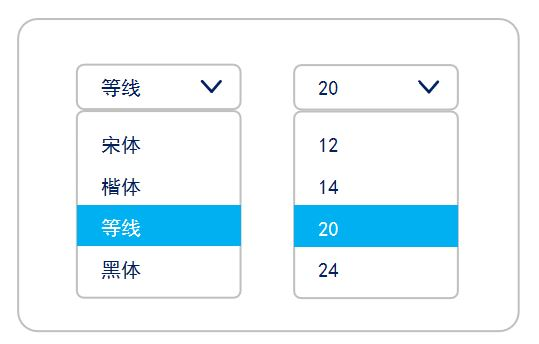

下拉列表部件由按钮和列表构成。

### 下拉列表部件的创建

```c
/**
  *	@brief	下拉列表创建函数
  */
lv_obj_t * lv_dropdown_create(lv_obj_t * parent);
```

### 下拉列表部件的样式设置

```c
/**
  *	@brief	下拉列表选项设置函数
  * @param	obj		对象指针
  * @param	options	列表选项 可以使用 "选项1\n选项2\n" 的字符串。
  */
void lv_dropdown_set_options(lv_obj_t * obj, const char * options);

/**
  *	@brief	下拉列表设置当前选项函数
  * @param	obj		对象指针
  * @param	sel_opt	选项索引，从0开始。
  */
void lv_dropdown_set_selected(lv_obj_t * obj, uint32_t sel_opt);

/**
  *	@brief	下拉列表设置显示方向函数
  * @param	obj		对象指针
  * @param	dir		方向，LV_DIR_...的宏
  */
void lv_dropdown_set_dir(lv_obj_t * obj, lv_dir_t dir);

/**
  *	@brief	下拉列表设置标识函数
  * @param	obj		对象指针
  * @param	symbol	标识
  */
void lv_dropdown_set_symbol(lv_obj_t * obj, const void * symbol);
```

## 10. 滚轮部件（`lv_roller`）

滚轮部件常用于多选一的场景，它以滚轮的形式来展现多个选项。

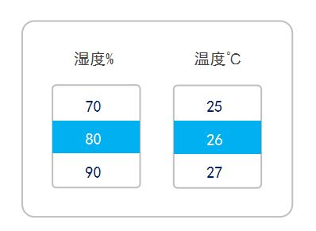

列表部件由主体（`LV_PART_MAIN`），选项框（`LV_PART_SELECTED`）构成。

### 滚轮部件的创建

```c
/**
  *	@brief	滚轮部件创建函数
  */
lv_obj_t * lv_roller_create(lv_obj_t * parent);
```

### 滚轮部件的样式设置

```c
/**
  *	@brief	选项间隔设置函数
  * @param	obj			对象指针
  * @param	value		间隔值
  * @param	selector	选择器
  */
void lv_obj_set_style_text_line_space(struct _lv_obj_t * obj, lv_coord_t value, lv_style_selector_t selector);

/**
  *	@brief	选项内容和滚动模式设置函数
  * @param	obj			对象指针
  * @param	options		选项 可以使用 "选项1\n选项2\n" 的字符串。
  * @param	mode 		模式，LV_ROLLER_MODE_NORMAL 或者 LV_ROLLER_MODE_INFINITE
  */
void lv_roller_set_options(lv_obj_t * obj, const char * options, lv_roller_mode_t mode);

/**
  *	@brief	选项可见行数设置函数
  * @param	obj			对象指针
  * @param	row_cnt		可见行数值
  */
void lv_roller_set_visible_row_count(lv_obj_t * obj, uint32_t row_cnt);
```

## 11. 滑块部件（`lv_slider`）

滑块部件常用于调节某个参数的值，它以直线滑动的形式来修改数值。

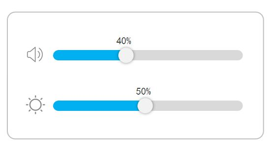

滑块部件由主体（`LV_PART_MAIN`），指示器（`LV_PART_INDICATOR`），旋钮（`LV_PART_KNOB`）构成。

### 滑块部件的创建

```c
/**
  *	@brief	滑块部件创建函数
  */
lv_obj_t * lv_slider_create(lv_obj_t * parent);
```

### 滑块状态的获取和设置

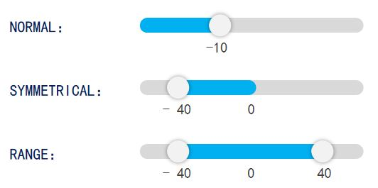

```c
/**
  *	@brief	最大最小值设置函数
  * @param	obj			对象指针
  * @param	max			最大值
  * @param	min			最小值
  */
static inline void lv_slider_set_range(lv_obj_t * obj, int32_t min, int32_t max);

/**
  *	@brief	当前值设置函数
  * @param	obj			对象指针
  * @param	value		当前值
  * @param	anim		动画使能状态，通常使用 LV_ANIM_ON
  */
static inline void lv_slider_set_value(lv_obj_t * obj, int32_t value, lv_anim_enable_t anim);

/**
  *	@brief	当前值获取函数
  * @param	obj			对象指针
  */
static inline int32_t lv_slider_get_value(lv_obj_t * obj);

/**
  *	@brief	模式设置函数
  * @param	obj			对象指针
  * @param	mode		模式，LV_SLIDER_MODE...宏
  */
static inline void lv_slider_set_mode(lv_obj_t * obj, lv_bar_mode_t mode);

/**
  *	@brief	左值设置函数
  * @param	obj			对象指针
  * @param	value		左值
  * @param	anim		动画使能状态，通常使用 LV_ANIM_ON
  */
static inline void lv_slider_set_left_value(lv_obj_t * obj, int32_t value, lv_anim_enable_t anim);
```

## 12. 圆弧部件（`lv_arc`）

圆弧部件以弧形滑动的形式来调节、显示某个参数的值。

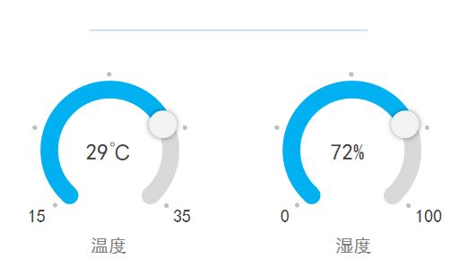

滑块部件由背景弧（`LV_PART_MAIN`），前景弧（`LV_PART_INDICATOR`），旋钮（`LV_PART_KNOB`）构成。

### 圆弧部件的创建

```c
/**
  *	@brief	滑块部件创建函数
  */
lv_obj_t * lv_arc_create(lv_obj_t * parent);
```

### 圆弧状态的获取和设置

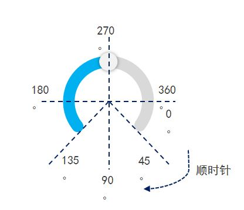

```c
/**
  *	@brief	最大最小值设置函数
  * @param	obj			对象指针
  * @param	max			最大值
  * @param	min			最小值
  */
void lv_arc_set_range(lv_obj_t * obj, int32_t min, int32_t max);

/**
  *	@brief	当前值设置函数
  * @param	obj			对象指针
  * @param	value		当前值
  */
void lv_arc_set_value(lv_obj_t * obj, int32_t value)

/**
  *	@brief	当前值获取函数
  * @param	obj			对象指针
  */
int32_t lv_arc_get_value(const lv_obj_t * obj)

/**
  *	@brief	模式设置函数
  * @param	obj			对象指针
  * @param	mode		模式，LV_ARC_MODE...宏
  */
void lv_arc_set_mode(lv_obj_t * obj, lv_arc_mode_t type);

/**
  *	@brief	绘制速率设置函数
  * @param	obj			对象指针
  * @param	rate		绘制速率
  */
void lv_arc_set_change_rate(lv_obj_t * obj, uint32_t rate)
    
/**
  *	@brief	前景弧角度设置函数
  * @param	obj			对象指针
  * @param	start		开始值
  * @param	end			结束值
  */
void lv_arc_set_angles(lv_obj_t * obj, uint32_t start, uint32_t end);

/**
  *	@brief	背景弧角度设置函数
  * @param	obj			对象指针
  * @param	start		开始值
  * @param	end			结束值
  */
void lv_arc_set_bg_angles(lv_obj_t * obj, uint32_t start, uint32_t end);

/**
  *	@brief	旋转角度设置函数
  * @param	obj			对象指针
  * @param	rotation	旋转角度
  */
void lv_arc_set_rotation(lv_obj_t * obj, uint32_t rotation);
```

