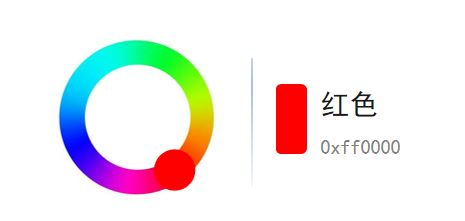
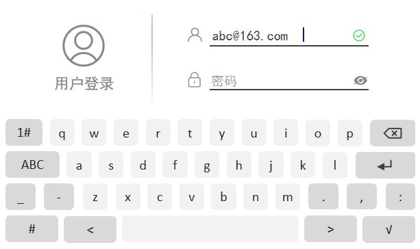

# STM32 LVGL 3_LVGL部件

## 1. 标签部件(`lv_label`)


标签部件主要用于文本显示，例如标题，提示信息等。

标签部件由主体`LV_PART_MAIN`，滚动条`LV_PART_SCROLLBAR`，选中文本`LV_PART_SELECTED`组成。

### 标签部件的创建

```c
/**
  *	@brief	标签创建函数
  */
lv_obj_t * lv_label_create(lv_obj_t * parent);
```

### 标签部件的文本设置

```c
/**
  *	@brief	标签文本设置函数
  * @note	存储文本的内存将会动态分配
  * @param	obj		标签对象
  * @param	text	文本
  */
void lv_label_set_text(lv_obj_t * obj, const char * text);

/**
  *	@brief	标签文本设置函数
  * @note	存储文本的内存将会存储在指定缓冲区中
  * @param	obj		标签对象
  * @param	text	文本
  */
void lv_label_set_text_static(lv_obj_t * obj, const char * text);

/**
  *	@brief	格式化显示标签文本函数
  */
void lv_label_set_text_fmt(lv_obj_t * obj, const char * fmt, ...);
```

### 标签部件的样式设置

```c
/**
  *	@brief	背景颜色设置函数，需要设置背景透明度
  * @param	obj			标签对象
  * @param	value		颜色值
  * @param	selector	选择器，一般为默认触发
  */
void lv_obj_set_style_bg_color(struct _lv_obj_t * obj, lv_color_t value, lv_style_selector_t selector);

/**
  *	@brief	背景透明度设置函数
  * @param	obj			标签对象
  * @param	value		透明度值
  * @param	selector	选择器，一般为默认触发
  */
void lv_obj_set_style_opa(struct _lv_obj_t * obj, lv_opa_t value, lv_style_selector_t selector);

/**
  *	@brief	字体大小设置函数
  * @param	obj			标签对象
  * @param	value		字体大小值
  * @param	selector	选择器，一般为默认触发
  */
void lv_obj_set_style_text_font(struct _lv_obj_t * obj, const lv_font_t * value, lv_style_selector_t selector);

/**
  *	@brief	文本颜色设置函数
  * @param	obj			标签对象
  * @param	value		颜色值
  * @param	selector	选择器，一般为默认触发
  */
void lv_obj_set_style_text_color(struct _lv_obj_t * obj, lv_color_t value, lv_style_selector_t selector)
```

> - 如果要对文字进行单独着色，使用以下代码：
>
> ```c
> lv_label_set_recolor( label, true ); 							   /* 开启重新着色功能 */
> lv_label_set_text( label, "hallo #ff0000 lvgl# " );					/* 单独设置颜色 */
> ```

### 标签部件的大小设置

默认情况下，如果没有限定标签部件大小，标签部件的大小自动扩展为文本大小。

> 如果文本超过了标签部件的大小，使用长文本模式：
>
> ```c
> enum {
>     LV_LABEL_LONG_WRAP,             		/* 默认模式, 如果部件大小已固定，超出的文本将被剪切 */
>     LV_LABEL_LONG_DOT,              		/* 将 label 右下角的最后 3 个字符替换为点... */
>     LV_LABEL_LONG_SCROLL,           		/* 来回滚动 */
>     LV_LABEL_LONG_SCROLL_CIRCULAR,  		/* 循环滚动 */
>     LV_LABEL_LONG_CLIP,             		/* 直接剪切掉部件外面的文本部分 */
> };
> 
> /**
>   *	@brief	长文本模式设置函数
>   * @param	obj			标签对象
>   * @param	long_mode	 模式选项
>   */
> void lv_label_set_long_mode(lv_obj_t * obj, lv_label_long_mode_t long_mode);
> ```
>

## 2. 按钮部件(`lv_btn`)


### 按钮部件的创建

```c
/**
  *	@brief	按钮创建函数
  */
lv_obj_t * lv_btn_create(lv_obj_t * parent);
```

### 按钮部件的样式设置

```c
/**
  *	@brief	背景颜色设置函数
  * @param	obj			按钮对象
  * @param	value		颜色值
  * @param	selector	选择器，一般为默认触发
  */
void lv_obj_set_style_bg_color(struct _lv_obj_t * obj, lv_color_t value, lv_style_selector_t selector);

/**
  *	@brief	大小设置函数
  * @param	obj			按钮对象
  * @param	w			宽度
  * @param	h			高度
  */
void lv_obj_set_size(lv_obj_t * obj, lv_coord_t w, lv_coord_t h);
```

### 按钮部件的事件设置

```c
/**
  *	@brief	标志设置函数
  * @param	obj			按钮对象
  * @param	f			事件标志，对于按钮为LV_OBJ_FLAG_CHECKABLE
  */
void lv_obj_add_flag(lv_obj_t * obj, lv_obj_flag_t f)
    
/**
  * @brief 	添加事件
  * @param	obj			父对象
  * @param	event_cb	事件回调函数
  * @param	filter		事件类型，通常为LV_EVENT_VALUE_CHANGED
  * @param  user_data	 进入回调函数的用户数据，通常为NULL
  */
struct _lv_event_dsc_t * lv_obj_add_event_cb(lv_obj_t * obj, lv_event_cb_t event_cb, lv_event_code_t filter,void * user_data);
```

## 3. 开关部件(`lv_switch`)

开关部件常用于控制某个功能的开启和关闭，它可以直接显示被控对象的状态。


开关由主体（`LV_PART_MAIN`），手柄（`LV_PART_KNOB`），指示器（`LV_PART_INDICATOR`）构成。

### 开关部件的创建

```c
/**
  *	@brief	开关创建函数
  */
lv_obj_t * lv_switch_create(lv_obj_t * parent);
```

### 开关状态的获取和设置

```c
/**
  *	@brief	开关状态设置函数
  * @param	state	开关状态
  */
void lv_obj_add_state(lv_obj_t * obj, lv_state_t state);

/**
  *	@brief	开关状态清除函数
  * @param	state	开关状态
  */
void lv_obj_clear_state(lv_obj_t * obj, lv_state_t state);

/**
  *	@brief	开关状态获取函数
  * @param	state	开关状态
  * @retval	返回bool类型
  */
bool lv_obj_clear_state(lv_obj_t * obj, lv_state_t state);
```

## 4. 复选框部件（`lv_checkbox`）

复选框部件常用于选择某个内容的开启和关闭，可以理解为自带标签的开关。


复选框部件由主体（`LV_PART_MAIN`），勾选框（`LV_PART_INDICATOR`）构成。

### 复选框部件的创建

```c
/**
  *	@brief	复选框创建函数
  */
lv_obj_t * lv_checkbox_create(lv_obj_t * parent);
```

### 复选框部件的样式设置

```c
/**
  *	@brief	复选框文本设置函数
  * @param	obj	对象指针
  * @param	txt	文本
  */
void lv_checkbox_set_text(lv_obj_t * obj, const char * txt);

/**
  *	@brief	复选框和文本间距设置函数
  * @param	obj			对象指针
  * @param	value		距离值
  * @param	selector	选择器，一般为默认触发
  */
void lv_obj_set_style_pad_column(struct _lv_obj_t * obj, lv_coord_t value, lv_style_selector_t selector);
```

### 复选框状态的获取和设置

（略）

## 5. 进度条部件（`lv_bar`）

进度条部件常用于显示当前任务的完成进度。


进度条部件由主体（`LV_PART_MAIN`），指示器（`LV_PART_INDICATOR`）构成。

### 进度条部件的创建

```c
/**
  *	@brief	进度条创建函数
  */
lv_obj_t * lv_bar_create(lv_obj_t * parent);
```

### 进度条部件的样式设置

```c
/**
  *	@brief	最大最小值设置函数
  * @param	obj			对象指针
  * @param	max			最大值
  * @param	min			最小值
  */
void lv_bar_set_range(lv_obj_t * obj, int32_t min, int32_t max);

/**
  *	@brief	当前值设置函数
  * @param	obj			对象指针
  * @param	value		当前值
  * @param	anim		动画使能状态，通常使用 LV_ANIM_ON
  */
void lv_bar_set_value(lv_obj_t * obj, int32_t value, lv_anim_enable_t anim);

/**
  *	@brief	动画时间设置函数
  * @param	obj			对象指针
  * @param	value		当前值
  * @param	selector	选择器，一般为默认触发
  */
void lv_obj_set_style_anim_time(struct _lv_obj_t * obj, uint32_t value, lv_style_selector_t selector);

// 模式设置
enum {
    LV_BAR_MODE_NORMAL,				/* 默认模式 */
    LV_BAR_MODE_SYMMETRICAL,		/* 从零值绘制到当前值（当前值可以小于0） */
    LV_BAR_MODE_RANGE				/* 允许设置起始值，但起始值必须小于当前值 */
};

/**
  *	@brief	模式设置函数
  * @param	obj			对象指针
  * @param	mode		模式
  */
void lv_bar_set_mode(lv_obj_t * obj, lv_bar_mode_t mode);
```

> - 当进度条高度大于宽度时，其方向变为垂直。
> - 动画时间设置需要放在当前值设置之前 ，否则看不到动画效果。
> - 动画时间指的是旧值刷新到新值的绘图时间，并不是现实中当前值变化所需的时间。

## 6. 加载器部件（`lv_spinner`）

加载器部件常用于提示当前任务正在加载。


加载器部件由主体（`LV_PART_MAIN`），指示器（`LV_PART_INDICATOR`），手柄（`LV_PART_KNOB`）构成。

### 加载器部件的创建

```c
/**
  *	@brief	加载器创建函数
  */
lv_obj_t * lv_spinner_create(lv_obj_t * parent);
```

### 加载器部件的样式设置

```c
/**
  *	@brief	圆弧颜色设置函数
  * @param	obj			对象指针
  * @param	value		颜色值
  * @param	selector	选择器
  */
void lv_obj_set_style_arc_color(struct _lv_obj_t * obj, lv_color_t value, lv_style_selector_t selector);

/**
  *	@brief	圆弧宽度设置函数
  * @param	obj			对象指针
  * @param	value		宽度值
  * @param	selector	选择器
  */
void lv_obj_set_style_arc_width(struct _lv_obj_t * obj, lv_coord_t value, lv_style_selector_t selector);
```

## 7. LED 部件（`lv_led`）

LED部件常用于指示控制对象的状态。


### LED 部件的创建

```c
/**
  *	@brief	LED创建函数
  */
lv_obj_t * lv_led_create(lv_obj_t * parent);
```

### LED 部件的样式设置

```c
/**
  *	@brief	LED颜色设置函数
  * @param	obj			对象指针
  * @param	color		颜色值
  */
void lv_led_set_color(lv_obj_t * obj, lv_color_t color);

/**
  *	@brief	LED亮度设置函数
  * @param	obj			对象指针
  * @param	bright		LED亮度
  */
void lv_led_set_brightness(lv_obj_t * obj, uint8_t bright);

/**
  *	@brief	LED状态设置函数
  * @param	obj			对象指针
  */
void lv_led_toggle(lv_obj_t * obj);
void lv_led_on(lv_obj_t * led);
void lv_led_off(lv_obj_t * led);
```

## 8. 列表部件（`lv_List`）

列表部件常用于多选一的场景，默认会展现多个选项。


列表部件由主体（`LV_PART_MAIN`），滚动条（`LV_PART_SCROLLBAR`）构成。

### 列表部件的创建

```c
/**
  *	@brief	列表创建函数
  */
lv_obj_t * lv_list_create(lv_obj_t * parent);
```

### 列表部件的样式设置

```c
/**
  *	@brief	列表文本设置函数
  * @param	obj	对象指针
  * @param	txt	文本
  */
lv_obj_t * lv_list_add_text(lv_obj_t * list, const char * txt);

/**
  *	@brief	列表按键设置函数
  * @param	obj		对象指针
  * @param	icon	按键图标
  * @param	txt		按键文本
  */
lv_obj_t * lv_list_add_button(lv_obj_t * list, const void * icon, const char * txt);
```

## 9. 下拉列表部件（`lv_dropdown`）

下拉列表部件常用于多选一的场景，点击后可展现多个选项。


下拉列表部件由按钮和列表构成。

### 下拉列表部件的创建

```c
/**
  *	@brief	下拉列表创建函数
  */
lv_obj_t * lv_dropdown_create(lv_obj_t * parent);
```

### 下拉列表部件的样式设置

```c
/**
  *	@brief	下拉列表选项设置函数
  * @param	obj		对象指针
  * @param	options	列表选项 可以使用 "选项1\n选项2\n" 的字符串。
  */
void lv_dropdown_set_options(lv_obj_t * obj, const char * options);

/**
  *	@brief	下拉列表设置当前选项函数
  * @param	obj		对象指针
  * @param	sel_opt	选项索引，从0开始。
  */
void lv_dropdown_set_selected(lv_obj_t * obj, uint32_t sel_opt);

/**
  *	@brief	下拉列表设置显示方向函数
  * @param	obj		对象指针
  * @param	dir		方向，LV_DIR_...的宏
  */
void lv_dropdown_set_dir(lv_obj_t * obj, lv_dir_t dir);

/**
  *	@brief	下拉列表设置标识函数
  * @param	obj		对象指针
  * @param	symbol	标识
  */
void lv_dropdown_set_symbol(lv_obj_t * obj, const void * symbol);
```

## 10. 滚轮部件（`lv_roller`）

滚轮部件常用于多选一的场景，它以滚轮的形式来展现多个选项。


列表部件由主体（`LV_PART_MAIN`），选项框（`LV_PART_SELECTED`）构成。

### 滚轮部件的创建

```c
/**
  *	@brief	滚轮部件创建函数
  */
lv_obj_t * lv_roller_create(lv_obj_t * parent);
```

### 滚轮部件的样式设置

```c
/**
  *	@brief	选项间隔设置函数
  * @param	obj			对象指针
  * @param	value		间隔值
  * @param	selector	选择器
  */
void lv_obj_set_style_text_line_space(struct _lv_obj_t * obj, lv_coord_t value, lv_style_selector_t selector);

/**
  *	@brief	选项内容和滚动模式设置函数
  * @param	obj			对象指针
  * @param	options		选项 可以使用 "选项1\n选项2\n" 的字符串。
  * @param	mode 		模式，LV_ROLLER_MODE_NORMAL 或者 LV_ROLLER_MODE_INFINITE
  */
void lv_roller_set_options(lv_obj_t * obj, const char * options, lv_roller_mode_t mode);

/**
  *	@brief	选项可见行数设置函数
  * @param	obj			对象指针
  * @param	row_cnt		可见行数值
  */
void lv_roller_set_visible_row_count(lv_obj_t * obj, uint32_t row_cnt);
```

## 11. 滑块部件（`lv_slider`）

滑块部件常用于调节某个参数的值，它以直线滑动的形式来修改数值。


滑块部件由主体（`LV_PART_MAIN`），指示器（`LV_PART_INDICATOR`），旋钮（`LV_PART_KNOB`）构成。

### 滑块部件的创建

```c
/**
  *	@brief	滑块部件创建函数
  */
lv_obj_t * lv_slider_create(lv_obj_t * parent);
```

### 滑块状态的获取和设置


```c
/**
  *	@brief	最大最小值设置函数
  * @param	obj			对象指针
  * @param	max			最大值
  * @param	min			最小值
  */
static inline void lv_slider_set_range(lv_obj_t * obj, int32_t min, int32_t max);

/**
  *	@brief	当前值设置函数
  * @param	obj			对象指针
  * @param	value		当前值
  * @param	anim		动画使能状态，通常使用 LV_ANIM_ON
  */
static inline void lv_slider_set_value(lv_obj_t * obj, int32_t value, lv_anim_enable_t anim);

/**
  *	@brief	当前值获取函数
  * @param	obj			对象指针
  */
static inline int32_t lv_slider_get_value(lv_obj_t * obj);

/**
  *	@brief	模式设置函数
  * @param	obj			对象指针
  * @param	mode		模式，LV_SLIDER_MODE...宏
  */
static inline void lv_slider_set_mode(lv_obj_t * obj, lv_bar_mode_t mode);

/**
  *	@brief	左值设置函数
  * @param	obj			对象指针
  * @param	value		左值
  * @param	anim		动画使能状态，通常使用 LV_ANIM_ON
  */
static inline void lv_slider_set_left_value(lv_obj_t * obj, int32_t value, lv_anim_enable_t anim);
```

## 12. 圆弧部件（`lv_arc`）

圆弧部件以弧形滑动的形式来调节、显示某个参数的值。


滑块部件由背景弧（`LV_PART_MAIN`），前景弧（`LV_PART_INDICATOR`），旋钮（`LV_PART_KNOB`）构成。

### 圆弧部件的创建

```c
/**
  *	@brief	圆弧部件创建函数
  */
lv_obj_t * lv_arc_create(lv_obj_t * parent);
```

### 圆弧状态的获取和设置


```c
/**
  *	@brief	最大最小值设置函数
  * @param	obj			对象指针
  * @param	max			最大值
  * @param	min			最小值
  */
void lv_arc_set_range(lv_obj_t * obj, int32_t min, int32_t max);

/**
  *	@brief	当前值设置函数
  * @param	obj			对象指针
  * @param	value		当前值
  */
void lv_arc_set_value(lv_obj_t * obj, int32_t value)

/**
  *	@brief	当前值获取函数
  * @param	obj			对象指针
  */
int32_t lv_arc_get_value(const lv_obj_t * obj)

/**
  *	@brief	模式设置函数
  * @param	obj			对象指针
  * @param	mode		模式，LV_ARC_MODE...宏
  */
void lv_arc_set_mode(lv_obj_t * obj, lv_arc_mode_t type);

/**
  *	@brief	绘制速率设置函数
  * @param	obj			对象指针
  * @param	rate		绘制速率
  */
void lv_arc_set_change_rate(lv_obj_t * obj, uint32_t rate)
    
/**
  *	@brief	前景弧角度设置函数
  * @param	obj			对象指针
  * @param	start		开始值
  * @param	end			结束值
  */
void lv_arc_set_angles(lv_obj_t * obj, uint32_t start, uint32_t end);

/**
  *	@brief	背景弧角度设置函数
  * @param	obj			对象指针
  * @param	start		开始值
  * @param	end			结束值
  */
void lv_arc_set_bg_angles(lv_obj_t * obj, uint32_t start, uint32_t end);

/**
  *	@brief	旋转角度设置函数
  * @param	obj			对象指针
  * @param	rotation	旋转角度
  */
void lv_arc_set_rotation(lv_obj_t * obj, uint32_t rotation);
```

## 13. 线条部件（`lv_line`）

线条部件能够在一组坐标点之间依次绘制直线。

### 线条部件的创建

```c
/**
  *	@brief	线条部件创建函数
  */
lv_obj_t * lv_line_create(lv_obj_t * parent);
```

### 线条部件的样式设置

```c
// 线条坐标点设置
static lv_point_t line_points[] = {{15, 5}, {25, 20}, {5, 20}, {15, 5}};

/**
  *	@brief	线条设置函数
  * @param	obj			对象指针
  * @param	points		坐标点数组
  * @param	point_num	坐标点数量
  */
void lv_line_set_points(lv_obj_t * obj, const lv_point_t points[], uint32_t point_num);

/**
  *	@brief 	线宽设置函数
  * @param	obj			对象指针
  * @param	value		线宽值
  * @param	selector	选择器
  */
void lv_obj_set_style_line_width(struct _lv_obj_t * obj, lv_coord_t value, lv_style_selector_t selector);

/**
  *	@brief 	圆角设置函数
  * @param	obj			对象指针
  * @param	value		是否设置圆角
  * @param	selector	选择器
  */
void lv_obj_set_style_line_rounded(struct _lv_obj_t * obj, bool value, lv_style_selector_t selector)
    
/**
  *	@brief 	Y轴反转设置函数
  * @param	obj			对象指针
  * @param	en			是否翻转
  */
void lv_line_set_y_invert(lv_obj_t * obj, bool en);
```


## 14. 图片部件（`lv_img`）

图片部件可用于图片显示、功能界面优化、背景优化等。


### 图片部件的创建

```c
/**
  *	@brief	图片部件创建函数
  */
lv_obj_t * lv_img_create(lv_obj_t * parent);
```

1. 图像的导入

[LVGL 图像转换器](https://lvgl.io/tools/imageconverter)

> - 一般使用默认选项；
> - 生成代码后，将`LV_COLOR_SIZE`转换为`LV_COLOR_DEPTH`。将`LV_IMG_CF_TRUE_COLOR`改为`LV_COLOR_FORMAT_RGB565`;

2. 图像的声明

在C文件中使用以下代码链接`img`：

```c
LV_IMG_DECLARE(img_qq);
lv_img_set_src(img, &img_qq);
```

### 图像部件的样式设置

```c
/**
  *	@brief 	设置 X,Y 轴偏移
  * @param	obj			对象指针
  * @param	x/y			偏移量
  */
void lv_image_set_offset_x(lv_obj_t * obj, lv_coord_t x);
void lv_image_set_offset_y(lv_obj_t * obj, lv_coord_t y);

/**
  *	@brief 	图片重新着色
  * @param	obj			对象指针
  * @param	value		颜色值/透明度
  * @param	selector	选择器		
  */
void lv_obj_set_style_image_recolor(struct _lv_obj_t * obj, lv_color_t value, lv_style_selector_t selector);
void lv_obj_set_style_image_recolor_opa(struct _lv_obj_t * obj, lv_opa_t value, lv_style_selector_t selector);

/**
  *	@brief 	图片尺寸设置
  * @param	obj			对象指针
  * @param	zoom		尺寸
  */
void lv_image_set_scale(lv_obj_t * obj, uint32_t zoom);

/**
  *	@brief 	图片旋转
  * @param	obj			对象指针
  * @param	angle		角度（输入值应为10倍）
  */
void lv_image_set_rotation(lv_obj_t * obj, int32_t angle);

/**
  *	@brief 	图片中心点设置
  * @param	obj			对象指针
  * @param	x/y			图片中心点
  */
void lv_image_set_pivot(lv_obj_t * obj, lv_coord_t x, lv_coord_t y);
```

## 15. 色环部件（`lv_colorwheel`）（本版本中无色环部件）

在UI设计中，色环部件一般用作颜色选择器。



色环部件由主体（`LV_PART_MAIN`），旋钮（`LV_PART_KNOB`）构成。

### 色环部件的创建

```c
/**
  *	@brief	色环部件创建函数
  */
lv_obj_t * lv_colorwheel_create(lv_obj_t * parent);
```

## 16. 按钮矩阵部件（`lv_btnmatrix`）

按钮矩阵部件可以在不同的行和列中显示多个轻量级按钮。


按钮矩阵部件由主体（`LV_PART_MAIN`），按钮（`LV_PART_ITEMS`）构成。

### 按钮矩阵部件的创建

```c
/**
  *	@brief	按钮矩阵部件创建函数
  */
lv_obj_t * lv_btnmatrix_create(lv_obj_t * parent);

// 按钮数组的创建，最后一个元素为空
static const char *map[] = {"btn1", "\n", "btn2", "btn3", ""};

/**
  *	@brief	按钮矩阵文本数量设置函数
  * @param	map		按钮数组
  */
void lv_buttonmatrix_set_map(lv_obj_t * obj, const char * map[]);
```

### 按钮矩阵部件的样式设置

```c
/**
  *	@brief 	按钮矩阵的间距设置
  * @param	obj			对象指针
  * @param	btn_id		按钮索引
  * @param	width		相对宽度
  */
void lv_buttonmatrix_set_button_width(lv_obj_t * obj, uint32_t btn_id, uint32_t width);

/**
  *	@brief 	单个按钮属性设置
  * @param	obj			对象指针
  * @param	btn_id		按钮索引
  * @param	ctrl		按钮属性
  */
void lv_buttonmatrix_set_button_ctrl(lv_obj_t * obj, uint32_t btn_id, lv_buttonmatrix_ctrl_t ctrl);
void lv_buttonmatrix_set_button_ctrl_all(lv_obj_t * obj, lv_buttonmatrix_ctrl_t ctrl);

/**
  *	@brief 	单次选中属性设置
  * @param	obj			对象指针
  * @param	en			状态属性
  */
void lv_buttonmatrix_set_one_checked(lv_obj_t * obj, bool en);
```

## 17. 文本区域部件（`lv_textarea`）

文本区域部件即文本输入框，用户可以在其中输入文本内容。


文本区域部件由主体（`LV_PART_MAIN`），滚动条（`LV_PART_SCROLLBAR`），所选文本（`LV_PART_SELECTED`），光标（`LV_PART_CURSOR`），占位符（`TEXTAREA_PLACEHOLDER`）构成。

### 文本区域部件的创建

```c
/**
  *	@brief	文本区域部件创建函数
  */
lv_obj_t * lv_textarea_create(lv_obj_t * parent);
```

### 文本区域部件的样式设置

```c
/**
  *	@brief 	文本添加函数
  * @param	obj			对象指针
  * @param	c			添加文本
  */
void lv_textarea_add_char(lv_obj_t * obj, uint32_t c);

/**
  *	@brief 	光标位置设置函数
  * @param	obj			对象指针
  * @param	pos			0：最左侧， LV_TEXTAREA_CURSOR_LAST：最右侧
  */
void lv_textarea_set_cursor_pos(lv_obj_t * obj, int32_t pos);

/**
  *	@brief 	单行模式设置函数
  * @param	obj			对象指针
  * @param	en			使能单行模式
  */
void lv_textarea_set_one_line(lv_obj_t * obj, bool en);

/**
  *	@brief 	密码模式设置函数
  * @param	obj			对象指针
  * @param	en			使能密码模式
  */
void lv_textarea_set_password_mode(lv_obj_t * obj, bool en);

/**
  *	@brief 	密码模式设置时间函数
  * @param	obj			对象指针
  * @param	time		密码显示时间
  */
void lv_textarea_set_password_show_time(lv_obj_t * obj, uint32_t time);

/**
  *	@brief 	限制接收字符
  * @param	obj			对象指针
  * @param	list		限制接收的字符
  */
void lv_textarea_set_accepted_chars(lv_obj_t * obj, const char * list);

/**
  *	@brief 	限制最大输入长度
  * @param	obj			对象指针
  * @param	num			最大输入长度
  */
void lv_textarea_set_max_length(lv_obj_t * obj, uint32_t num);

/**
  *	@brief 	占位符设置长度
  * @param	obj			对象指针
  * @param	txt			占位符文本
  */
void lv_textarea_set_placeholder_text(lv_obj_t * obj, const char * txt);

/**
  *	@brief 	文本获取函数
  * @param	obj			对象指针
  */
const char * lv_textarea_get_text(const lv_obj_t * obj);
```

## 18. 键盘部件（`lv_keyboard`）

键盘部件可用于输入文本内容，其本质上就是一个特殊的按钮矩阵。



键盘部件由主体（`LV_PART_MAIN`），按钮（`LV_PART_ITEMS`）构成。

### 键盘部件的创建

```c
/**
  *	@brief	键盘部件部件创建函数
  */
lv_obj_t * lv_keyboard_create(lv_obj_t * parent);
```

### 键盘部件样式设置函数

```c
/**
  *	@brief 	键盘 文本框设置函数
  * @param	obj			对象指针
  * @param	txt			占位符文本
  */
void lv_keyboard_set_textarea(lv_obj_t * obj, lv_obj_t * ta);

/**
  *	@brief 	按键弹窗使能函数
  * @param	obj			对象指针
  * @param	en			使能案件弹窗
  */
void lv_keyboard_set_popovers(lv_obj_t * obj, bool en);

/**
  *	@brief 	键盘模式函数
  * @param	obj			对象指针
  * @param	mode		键盘模式
  */
void lv_keyboard_set_mode(lv_obj_t * obj, lv_keyboard_mode_t mode);

enum _lv_keyboard_mode_t {
    LV_KEYBOARD_MODE_TEXT_LOWER,
    LV_KEYBOARD_MODE_TEXT_UPPER,
    LV_KEYBOARD_MODE_SPECIAL,
    LV_KEYBOARD_MODE_NUMBER,
    LV_KEYBOARD_MODE_USER_1,
    LV_KEYBOARD_MODE_USER_2,
    LV_KEYBOARD_MODE_USER_3,
    LV_KEYBOARD_MODE_USER_4,
#if LV_USE_ARABIC_PERSIAN_CHARS == 1
    LV_KEYBOARD_MODE_TEXT_ARABIC
#endif
};
```

## 19. 图片按钮部件（`lv_imgbtn`）

图片按钮部件类似于按钮部件，不同的是，用户可以在其中设置图片。


### 图片按钮部件的创建

```c
/**
  *	@brief	键盘部件创建函数
  */
lv_obj_t * lv_imgbtn_create(lv_obj_t * parent);
```

### 图片按钮部件的样式设置


```C
/**
  *	@brief	图片源设置
  * @param	obj			对象指针
  * @param	state		按钮状态
  * @param	src_left	左图片源
  * @param	src_mid		中图片源
  * @param	src_right	右图片源
  */
void lv_imgbtn_set_src(lv_obj_t * obj, lv_imgbtn_state_t state, const void * src_left, const void * src_mid,const void * src_right);
```

## 20. 选项卡部件（`lv_tabview`）

选项卡部件可以实现多页面切换，用户可以在不同的页面中添加内容。


### 选项卡部件的创建

```c
/**
  *	@brief	选项卡部件创建函数
  * @param	tab_pos		选项卡位置，LV_DIR_...
  * @param	tab_size	选项卡高度
  */
lv_obj_t * lv_tabview_create(lv_obj_t * parent, lv_dir_t tab_pos, lv_coord_t tab_size);
```

### 选项卡部件样式设置

```c
/**
  *	@brief	设置当前选中的选项卡
  * @param	obj			对象指针
  * @param	id			选项卡id
  * @param	anim_en		动画使能
  */
void lv_tabview_set_act(lv_obj_t * obj, uint32_t id, lv_anim_enable_t anim_en);

/**
  *	@brief	选项卡添加函数
  * @param	obj			对象指针
  * @param	name		选项卡名
  */
lv_obj_t * lv_tabview_add_tab(lv_obj_t * obj, const char * name);
```

## 21. 平铺视图部件（`lv_tileview`）

平铺视图部件可以实现不同方向的页面切换，用户可以页面中添加内容。


### 平铺视图部件的创建

```c
/**
  *	@brief	平铺视图部件创建函数
  */
lv_obj_t * lv_tileview_create(lv_obj_t * parent);
```

### 平铺视图部件的样式设置

```c
/**
  *	@brief	页面添加函数
  * @param	tv				对象指针
  * @param	col_id/row_id	 行列id
  * @param	dir				方向
  */
lv_obj_t * lv_tileview_add_tile(lv_obj_t * tv, uint8_t col_id, uint8_t row_id, lv_dir_t dir);

/**
  *	@brief	设置当前显示页面
  * @param	obj			对象指针
  * @param	id/tile_obj	 页面id/页面对象
  * @param	anim_en		动画使能
  */
void lv_obj_set_tile(lv_obj_t * obj, lv_obj_t * tile_obj, lv_anim_enable_t anim_en);
```

## 22. 窗口部件（`lv_win`）

窗口部件可以作为一个容器，展现不同功能的页面。


窗口部件由头部（`header`）和主体（`content`）构成。

### 窗口部件的创建

```c
/**
  *	@brief	窗口部件创建函数
  */
lv_obj_t * lv_win_create(lv_obj_t * parent);
```

### 窗口部件的样式设置

```c
/**
  *	@brief	标题设置
  * @param	win			对象指针
  * @param	txt			标题文本	
  */
lv_obj_t * lv_win_add_title(lv_obj_t * win, const char * txt);

/**
  *	@brief	头部按键设置
  * @param	win			对象指针
  * @param	icon		按键标识
  * @param	btn_w		按键宽度
  */
lv_obj_t * lv_win_add_button(lv_obj_t * win, const void * icon, lv_coord_t btn_w);

/**
  *	@brief	主体获取函数
  * @param	win			对象指针
  * @retval	窗口主体指针
  */
lv_obj_t * lv_win_get_content(lv_obj_t * win);
```

## 23. 消息框部件（`lv_msgbox`）

消息框部件可以实现弹窗提示，常用于消息通知、确定操作等。


消息框部件由标题（`title`）和主体（`obj`），关闭按钮（`close_btn`），内容（`content`），按钮矩阵（`btnmatrix`）构成。

### 消息框部件的创建

```c
// 创建按钮矩阵
static const char *btns[] = {"Continue", "Close", ""}; // 最后一项为空

/**
  *	@brief	消息框部件创建函数
  * @param	title			标题文本
  * @param	txt				主题文本
  * @param	btn_txts		 按钮矩阵文本
  * @param	add_close_btn	 是否使用关闭按钮
  */
lv_obj_t * lv_msgbox_create(lv_obj_t * parent, const char * title, const char * txt, const char * btn_txts[],bool add_close_btn);
```

### 消息框部件的状态获取

```c
lv_obj_t *target = lv_event_get_current_target(e);	  // 获取当前触发源 
lv_msgbox_get_active_btn(target);					// 获取按钮索引 
lv_msgbox_get_active_btn_text(target);				// 获取按钮文本 
```

## 24. 微调器部件（`lv_spinbox`）

微调器部件本质上就是一个数字文本，常用于精确调节某个参数的值。


微调器部件由主体（`LV_PART_MAIN`），光标（`LV_PART_CURSOR`）构成。

### 微调器部件的创建

```c
/**
  *	@brief	微调器部件创建函数
  */
lv_obj_t * lv_spinbox_create(lv_obj_t * parent);
```

### 微调器部件的样式设置

```c
/**
 * @brief	设置微调器步进值
 * @param 	spinbox  	对象指针
 * @param 	step 		步进值
 */
void lv_spinbox_set_step(lv_obj_t * obj, uint32_t step);

/**
 * @brief	设置微调器范围
 * @param 	spinbox  	对象指针
 * @param 	range_min 	最小值
 * @param 	range_max 	最大值
 */
void lv_spinbox_set_range(lv_obj_t * obj, int32_t range_min, int32_t range_max);
    
/**
 * @brief	设置光标位置
 * @param 	spinbox  	对象指针
 * @param 	pos 		光标位置，从末端开始计数
 */
void lv_spinbox_set_cursor_pos(lv_obj_t * obj, uint32_t pos);

/**
 * @brief	设置当前值
 * @param 	obj 	对象指针
 * @param 	i  		当前值
 */
void lv_spinbox_set_value(lv_obj_t * obj, int32_t i);

/**
 * @brief	设置数字位数和小数点值
 * @param 	spinbox 			对象指针
 * @param 	digit_count 		数字位数
 * @param 	separator_position 	小数点位置
 */
void lv_spinbox_set_digit_format(lv_obj_t * obj, uint32_t digit_count, uint32_t separator_position);


/**
 * @brief	获取整数值
 * @param 	obj 	对象指针
 * @return 	整数的微调器值
 */
int32_t lv_spinbox_get_value(lv_obj_t * obj);

/**
 * @brief	递增和递减微调器
 */
void lv_spinbox_increment(lv_obj_t * obj);
void lv_spinbox_decrement(lv_obj_t * obj);
```

## 25. 表格部件（`lv_table`）

表格部件由一个个单元格组成，它的单元格中只能存放文本形式的内容。


表格部件由主体（`LV_PART_MAIN`），单元格（`LV_PART_ITEMS`）构成。

### 表格部件的创建

```c
/**
  *	@brief	微调器部件创建函数
  */
lv_obj_t * lv_table_create(lv_obj_t * parent);
```

### 表格部件的样式设置

```c
/**
 * @brief	行数列数设置函数
 * @param 	obj 				对象指针
 * @param	row_cnt/col_cnt		 行数/列数
 */
void lv_table_set_row_cnt(lv_obj_t * obj, uint32_t row_cnt);
void lv_table_set_col_cnt(lv_obj_t * obj, uint32_t col_cnt);

/**
 * @brief	列宽设置函数
 * @param 	obj 				对象指针
 * @param	col_id				列的id
 * @param	w					列宽度
 */
void lv_table_set_col_width(lv_obj_t * obj, uint32_t col_id, lv_coord_t w);

/**
 * @brief	列宽设置函数
 * @param 	obj 				对象指针
 * @param	row					行
 * @param	col					列
 * @param	txt					文本
 */
void lv_table_set_cell_value(lv_obj_t * obj, uint32_t row, uint32_t col, const char * txt);
```

